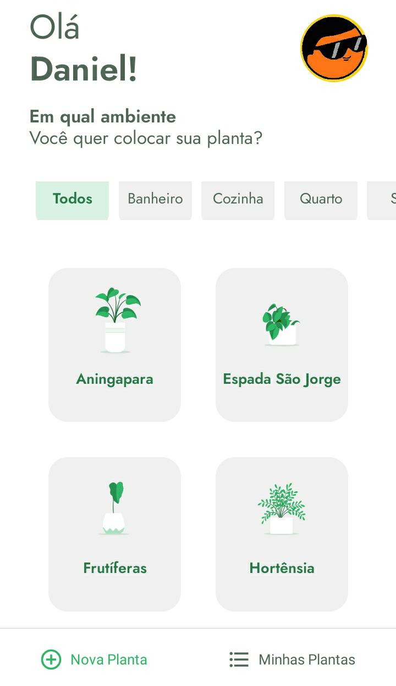

# PLANT MANAGER - Gerenciador de Plantas

### SOBRE
Um aplicativo desenvolvido em React Native durante o evento Next Level Week ministrado pela Rocketseat. Ele integra diferentes bibliotecas e apis para garantir o aprendizado e oferecer uma boa interface para o usuário final;



#### NECESSÁRIO
* Gerenciador de pacotes como o [Yarn](https://classic.yarnpkg.com/en/docs/install/) ou [Npm](https://www.npmjs.com/get-npm)
* Expo 4.4.2 ou posterior
```  bash
npm install --global expo-cli
yarn global add expo-cli
 ```
* Simulador Android/IOS, ou um celular com  o Expo Go na [Google Play](https://play.google.com/store/apps/details?id=host.exp.exponent&hl=pt_BR&gl=US)  ou [AppStore](https://apps.apple.com/br/app/expo-go/id982107779)
* Editor de código como o [Visual Studios Code](https://code.visualstudio.com/) ou de sua preferência (Opcional)
#### INSTALAÇÃO LOCAL
Para instalar e iniciar o aplicativo localmente:
``` bash
git clone https://github.com/DanielVitorSM/plant-manager
cd plant-manager/
yarn install ou npm install
expo start
```
Para instanciar a fake api com json-server:
``` sh
yarn global add json-server ou npm install --global json-server
cd plant-manager/
json-server src/services/server.json --host <IP> --port <PORT> --delay <DELAY>

```
* O DELAY pode ser usado para simular uma atraso de api, é opcional
* Deve-se também mudar a ```baseURL```localizado na pasta ```src/services/api.ts``` para que o app possa funcionar corretamente.
----------------------------
#### MAIS INFORMAÇÕES
Daniel Vitor Silva Moreira
contato.danielsmoreira@gmail.com
Evento Next Level Week por Rockeatseat
Tilha React Native

#### LINKS
https://rocketseat.com.br/
https://github.com/Rocketseat
https://www.linkedin.com/school/rocketseat
